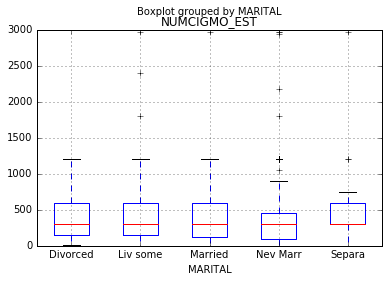

#syntax used to run an ANOVA
[Link to Code Syntax](https://github.com/daisuke834/Coursera/blob/master/DataAnalysis_and_Interpretation__Wesleyan/DataAnalysisTools/week1/Assignment1_ANOVA.py "Link to Code Syntax")

#output
[Link to Output](https://github.com/daisuke834/Coursera/blob/master/DataAnalysis_and_Interpretation__Wesleyan/DataAnalysisTools/week1/output.txt "Link to Output")

# interpretation
ANOVA revealed that CURRENT MARITAL STATUS has a significant affect on number of cigarettes per month (F=5.457 and P=0.000230).
Post hoc comparisons of fmean number of current number of cigarettes per month revealed that those who have never been married tend to smoke (mean=308.6) significantly lower number of cigarettes per month than those who are living with someone as if married (mean=394.9) and those who are separated (mean=443.2).

