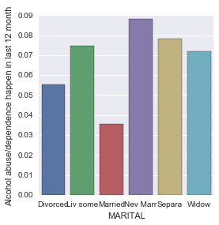

#syntax used to run an ANOVA
[Link to Code Syntax](https://github.com/daisuke834/Coursera/blob/master/DataAnalysis_and_Interpretation__Wesleyan/DataAnalysisTools/week2/Assignment2_ChiSquare.py "Link to Code Syntax") <-Click Here

#output
[Link to Output](https://github.com/daisuke834/Coursera/blob/master/DataAnalysis_and_Interpretation__Wesleyan/DataAnalysisTools/week2/output.txt "Link to Output") <-Click Here

# interpretation
* Data: Adults age 20 to 50.
* Explanatory Variable: CURRENT MARITAL STATUS which is collapsed into 6 ordered categories. 1. Married, 2. Living with someone as if married, 3. Widowed, 4. Divorced, 5. Separated, 6. Never Married
* Response Variable: Alcohol abuse/dependence happen in the last 12 month

Chi-Square test revealed that current marital status and alcohol abuse were significantly associated, X2=180.5, p=4.2e-37.

Post hoc comparisons of alcohol abuse by pairs of marital statuses revealed that marital status and alcohol abuse were significantly associated for all of the comparison pairs (15 comparisons) because each p-value was smaller than Bonferroni-Adjustment=0.0017. The result also showed that those who have been never married tend to have the highest rate of alcohol abuse, and those who are married tend to have the lowest rate of alcohol abuse.

