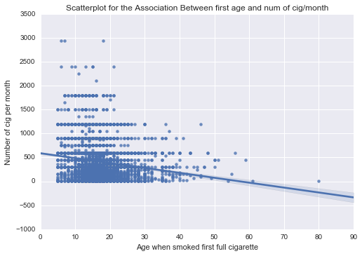

#syntax used to run Pearson Correlation
[Link to Code Syntax](https://github.com/daisuke834/Coursera/blob/master/DataAnalysis_and_Interpretation__Wesleyan/DataAnalysisTools/week3/Assignment3_PearsonCorrelation.py "Link to Code Syntax") <-Click Here

#output
    association between first age and num of cig/month
    (-0.15133870139656994, 6.5684313328860354e-51)
    R=-0.151338701397
    R-square=0.0229034025404
    p=6.56843133289e-51

# interpretation
* Data: Adults age 18 to 100.
* Explanatory Variable: Number of cigs per month
* Response Variable: Age when smoked first full cigarette

Pearson Correlation study revealed that there was a weak correlation between number of cigs per month and first age (R=-0.15), but we can predict only 2% of variability of number of cigs per month by age when smoked first full cigarette. Because p-value is extremely small (p=6.6e-51), the relationship is statistically significant.

