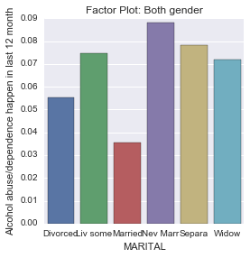
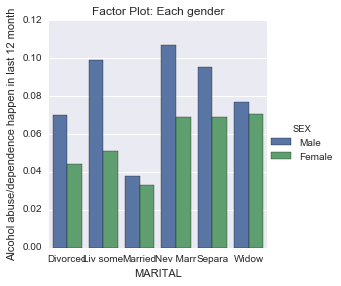

#syntax used to run Chi-Square
[Link to Code Syntax](https://github.com/daisuke834/Coursera/blob/master/DataAnalysis_and_Interpretation__Wesleyan/DataAnalysisTools/week4/Assignment4_PotentialModerator.py "Link to Code Syntax") <-Click Here

#output
[Link to Output](https://github.com/daisuke834/Coursera/blob/master/DataAnalysis_and_Interpretation__Wesleyan/DataAnalysisTools/week4/output.txt "Link to Output") <-Click Here

# interpretation
* Data: Adults age 20 to 50.
* Explanatory Variable: CURRENT MARITAL STATUS which is collapsed into 6 ordered categories. 1. Married, 2. Living with someone as if married, 3. Widowed, 4. Divorced, 5. Separated, 6. Never Married
* Response Variable: Alcohol abuse/dependence happen in the last 12 month
* Potential Moderator: Gender (Sex)

## Without Moderator
Chi-Square test without moderator revealed that current marital status and alcohol abuse were significantly associated, X2=180.5, p=4.2e-37. Post hoc comparisons of alcohol abuse by pairs of marital statuses without moderator revealed that marital status and alcohol abuse were significantly associated for the following 5 comparisons among 15 comparisons because thse p-values were smaller than Bonferroni-Adjustment=0.0033:
* Married vs Living with someone (p=3.473738e-08)
* Married vs Divorced (p=0.000044)
* Married vs Separated (p=4.434827e-08)
* Married vs Never Married (p=1.625864e-39)
* Divorced vs Never Married (p=2.862612e-06)

The result showed that those who have been never married tend to have the higher rate of alcohol abuse than those who are married and those who are divorced. The result also showed that those who are married tend to have the lower rate of alcohol abuse than the others except for the widowed.

## With Moderator
I used Gender (Sex) as a moderator.
The following figure implies that alcohol abuse/dependense of female on marital is less significant than male.

I did a Chi-Square test and post hoc comparison on each subset of gender. Chi-Squared value of female (X2=53.7, p=2.4e-10) is much smaller than the value of male (X2=133.8, p=p=3.8e-27). Association between marital status and alcohol abuse of female is still significant, but smaller number of comparisons pairs are significant for female than male.
### Male
Marital status and alcohol abuse of male are significantly associated for the following comparisons.
* Married vs Living with someone (p=1.311669e-08)
* Married vs Divorced (p=3.252294e-05)
* Married vs Separated (p=2.678406e-05)
* Married vs Never Married (p=1.282795e-29)
* Divorced vs Never Married (p=1.623272e-03)

### Female
Marital status and alcohol abuse of male are significantly associated for the following comparisons.
* Married vs Separated (p=0.000231)
* Married vs Never Married (p=4.602738e-12)
