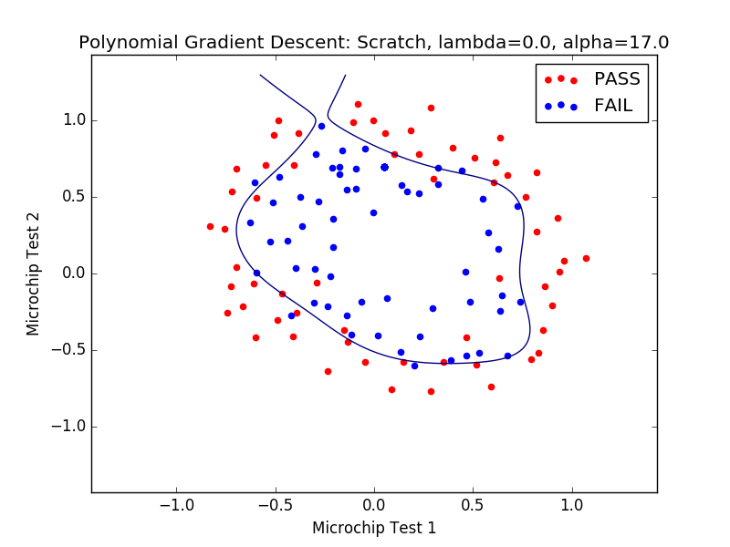
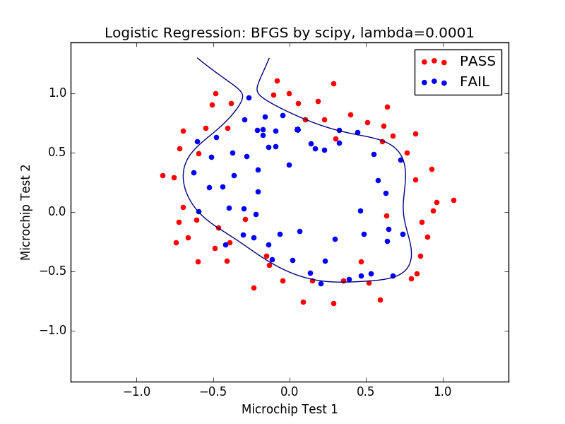
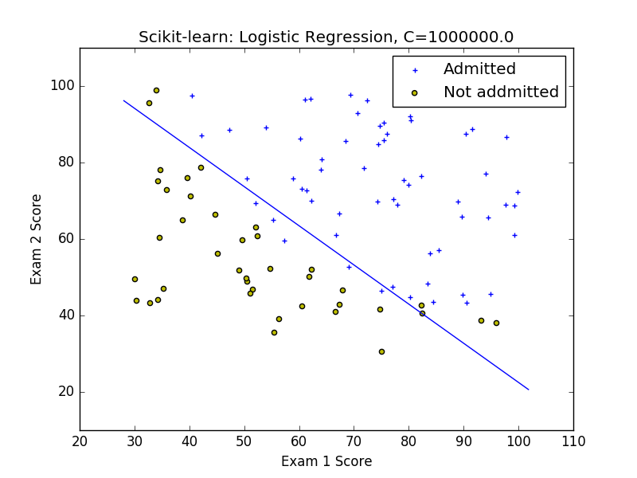
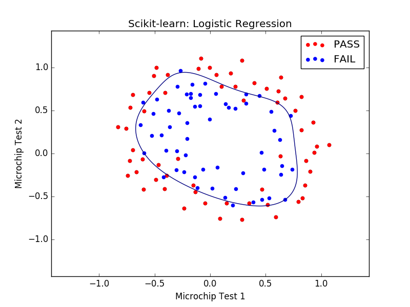
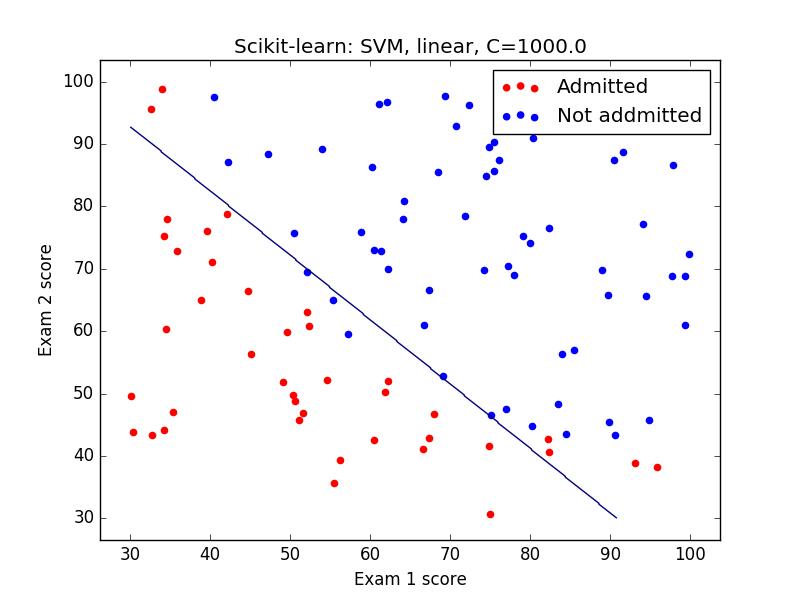
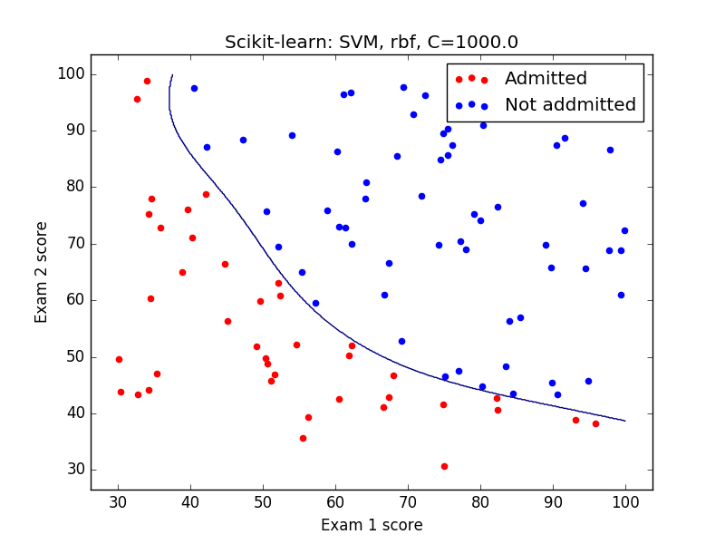
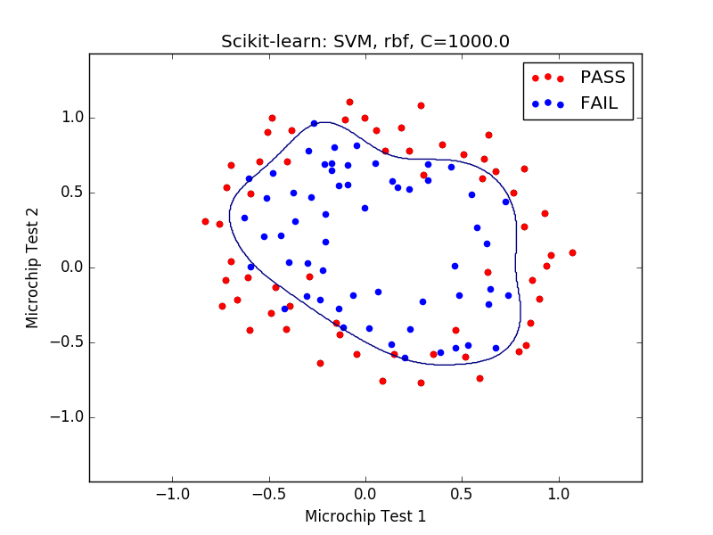
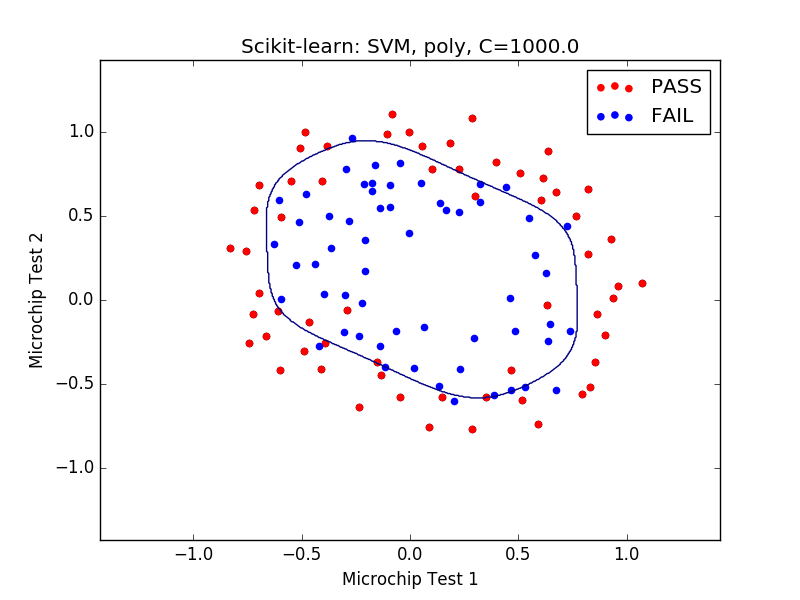

# Classification

## Logistic Regression: Gradient Discent (Scratch code)

## Logistic Regression: BFGS (using scipy)

## Logistic Regression: Scikit-learn

## Support Vector Machine: Scikit-learn

